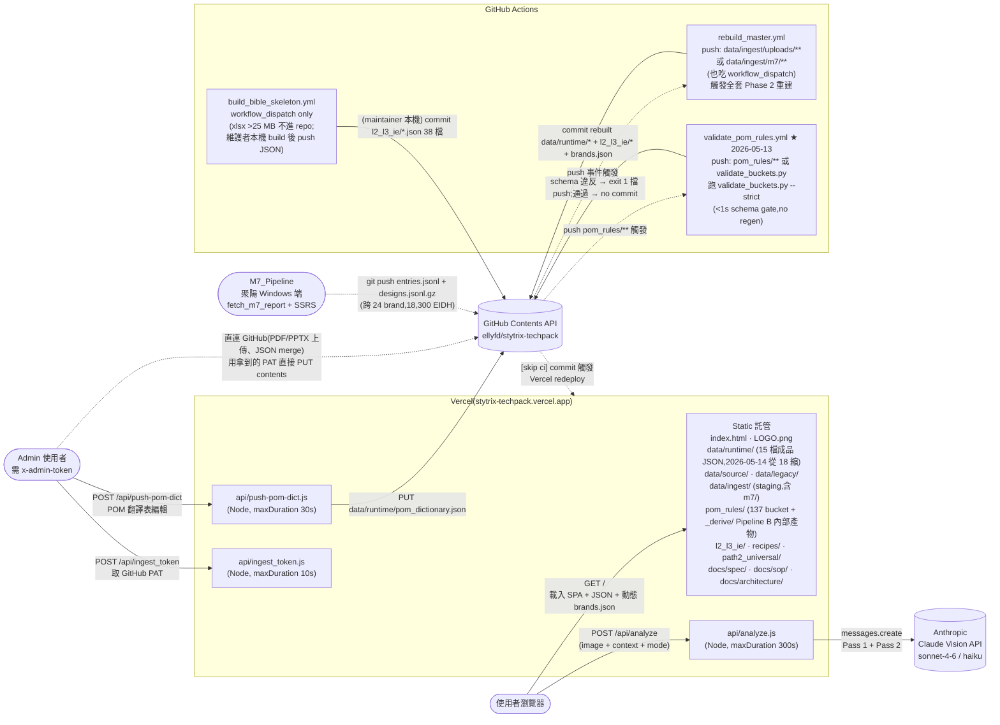
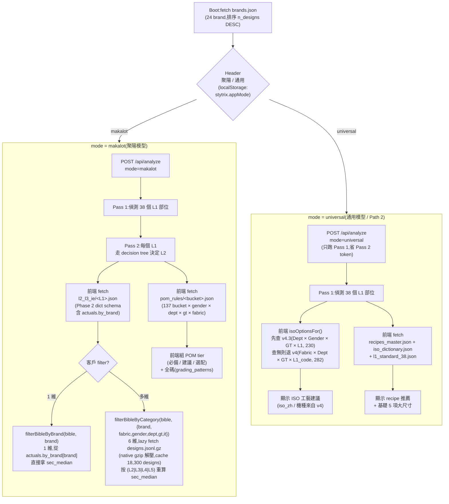
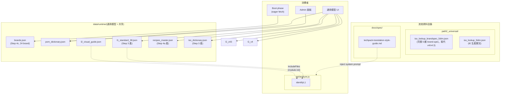

# StyTrix Techpack 網站架構圖

範圍:線上網站(前端 + Vercel Functions + GitHub Actions pipeline + 外部服務 + 資料相依)的全貌。
只畫「跑在線上或會被線上 trigger 到」的東西;純線下一次性的 `scripts/core/` 規則產線(Pipeline B)不在本圖內(細節見 `docs/sop/pom_rules_pipeline_guide_v2.md`)。

> **快照日**:2026-05-14(在 2026-05-11 之上加 `m7_pullon → m7` rename + M7_Pipeline v11 import + POM rules v6→v8(81 → 137 buckets)+ `validate_pom_rules.yml` workflow 拆出 + `CodeBrowserModal` 上線)。
> 改動 changelog 走 [`CLAUDE.md` Part A 快照區](../../CLAUDE.md#part-a--資料夾分工表),本檔不重述。

---

## 1. 高階流程(Browser → Vercel → 外部 API / Actions)



**關鍵設計**:
- 純靜態 SPA(無 bundler、無 `package.json`),React 走 CDN,整個 app 在 `index.html` 內聯。
- 所有 functions 都是 Vercel **Node.js runtime**,不是 Edge runtime。Anthropic 模型 Pass 1/2 用 `claude-sonnet-4-6`,Step 2b VLM 用 `claude-haiku-*`。
- `api/analyze.js` 在 module init `fs.readFileSync` 讀四份:`data/runtime/l2_visual_guide.json`、`data/runtime/l2_decision_trees.json`、`data/runtime/l1_standard_38.json`、`docs/spec/techpack-translation-style-guide.md`。靠 `vercel.json` 的 `includeFiles` 把這 4 個檔精確打包進 function bundle(2026-05-14 從 `{data/**, ...}` 收緊成顯式 4 檔列表,bundle 從 91 MB → 184 KB,改 fetch 會 hang)。
- `api/ingest_token` 的作用只有一個:把 `GITHUB_PAT` 給已驗證的 admin,讓瀏覽器**直連** GitHub API,繞過 Vercel 4.5 MB body 上限。上傳路徑統一走這條(2026-04-24 移除原規劃但未實作的 `api/ingest_upload` 小檔路徑)。
- **Pipeline 外送包 / 回流**(PackageModal + ResultsUploadModal)**永遠**走直連 GitHub 不經 Vercel endpoint。
- **資料重建不經過 Vercel function** — 是 GitHub Actions workflow `rebuild_master.yml` 在 GitHub 端跑的;聚陽 M7_Pipeline push 也吃同一條 workflow。
- `build_bible_skeleton.yml` 2026-05-08 起改 `workflow_dispatch only`:Bible xlsx 35.7 MB 超過 GitHub web upload 25 MB 上限,改由維護者本機跑 `scripts/core/build_bible_skeleton.py` 後 push 38 個 JSON(SOP 見 `data/source/BIBLE_UPGRADE.md`)。線上不再有 xlsx 上傳通道。

---

## 2. 前端模式分流(Header 切換的兩條 pipeline)

`localStorage.stytrix.appMode` 控制整個 UI 與後端走哪條路。Boot 時前端 eager fetch `./data/runtime/brands.json` 餵 Brand 下拉(2026-05-11+ 不再硬寫 `const BRANDS = [...]`)。



**filterBibleByCategory 為什麼需要 lazy fetch designs.jsonl.gz**:
Bible 自帶的 `actuals.by_brand[brand]` 只有 1 維(brand)的聚合;要再切性別/品類/紗線等需要回到 per-EIDH 原始工段資料重算 sec_median。`designs.jsonl.gz` 31 MB gzipped / ~332 MB JSON parse 後 ~18,300 designs,前端用 native `DecompressionStream('gzip')` 解壓(Chrome/Edge/Firefox + Safari 16.4+ 全支援),parse 一次 cache 在 module scope,後續 filter 切換瞬間完成。失敗 graceful fallback 到 `filterBibleByBrand`。

---

## 3. 資料檔依賴圖(誰吃誰)

實線 = 線上 runtime 直接讀;虛線 = 靠 `vercel.json includeFiles` 編進 function bundle;粗線 = lazy 第二次 fetch。
依照 Section 2 的雙 mode 分流拆兩張(原本一張 TB 30 個 node 會被擠成一條長橫帶,改成兩張就鬆得開)。

### 3a 聚陽模型(makalot mode)

```mermaid
flowchart TB
  subgraph Top["消費者"]
    direction LR
    FE_boot["Boot phase<br/>(eager fetch)"]
    FE_make["聚陽模型 UI"]
    FE_admin["Admin 面板"]
    subgraph Fn["api/analyze.js"]
      direction TB
      FN_pass1["identifyL1"]
      FN_pass2["identifyL2"]
    end
  end

  subgraph Runtime["data/runtime/(聚陽模型 + 共享)"]
    direction LR
    D_brands["brands.json<br/>(Step 4c, 24 brand)"]
    D_pomdict["pom_dictionary.json<br/>(admin 可編)"]
    D_guide["l2_visual_guide.json"]
    D_trees["l2_decision_trees.json"]
    D_l1std["l1_standard_38.json"]
    D_grading["grading_patterns.json"]
    D_bodyvar["bodytype_variance.json"]
    D_pres["l1_part_presence_v1.json"]
    D_iso["l1_iso_recommendations_v1.json"]
  end

  subgraph Other["其他資料目錄"]
    direction LR
    subgraph IE["l2_l3_ie/ (Phase 2 dict)"]
      IE_files["&lt;L1&gt;.json × 38<br/>+ actuals.by_brand 24 brand"]
    end
    subgraph PomRules["pom_rules/"]
      P_files["&lt;bucket&gt;.json × 137 + _index"]
    end
    subgraph Ingest["data/ingest/m7/"]
      M_designs["designs.jsonl.gz<br/>(18,300 designs, lazy)"]
    end
    subgraph Spec["docs/spec/"]
      R_style["techpack-translation-style-guide.md"]
    end
  end

  %% Boot
  FE_boot --> D_brands

  %% Fn includeFiles
  D_guide -. "includeFiles<br/>(module init)" .-> FN_pass1
  D_l1std -.-> FN_pass1
  D_guide -.-> FN_pass2
  D_trees -.-> FN_pass2
  R_style -. "inject system prompt" .-> Fn

  %% 聚陽模型 runtime fetch
  FE_make --> IE_files
  FE_make --> P_files
  FE_make --> D_pres
  FE_make --> D_iso
  FE_make --> D_grading
  FE_make --> D_bodyvar
  FE_make --> D_guide
  FE_make ==> M_designs

  %% 共享
  FE_make --> D_pomdict
  FE_admin --> D_pomdict
```



**聚陽模型重點**:
- AI 走兩段 Pass(Pass 1 偵測 L1、Pass 2 走 decision tree 決定 L2),Function bundle 在 module init 一次性 `readFileSync` 灌進 `l2_visual_guide` / `l2_decision_trees` / `l1_standard_38` / `techpack-translation-style-guide.md`(`vercel.json includeFiles`)。
- 前端拿到 L1/L2 後 fetch `l2_l3_ie/<L1>.json` 展開 L3-L5 工段,需要 brand-specific 數據時走 `filterBibleByBrand`(從 Bible 自帶 actuals 直接拿)或更細的 `filterBibleByCategory`(lazy fetch `designs.jsonl.gz` 重算)。
- POM 維度走 `pom_rules/<bucket>.json` 137 bucket;跳碼走 `grading_patterns`。

### 3b 通用模型(universal mode)



**通用模型重點**:
- AI **只跑 Pass 1**(偵測 L1),省掉 Pass 2 的 decision tree token;function bundle 也只需 `GUIDE + L1_STD + STYLE`(不灌 TREES)。
- 前端拿到 L1 後 `isoOptionsFor()` 先查 `v4.3`(Dept × Gender × GT × L1, 230 entries),查無退 `v4`(Fabric × Dept × GT × L1_code, 282 entries 提供 `iso_zh` / 機種)。
- 同時 fetch `recipes_master.json` / `iso_dictionary.json` / `l1_standard_38.json` 展示 recipe 推薦 + 5 項基礎大尺寸。

### 兩路共享 + 不在本圖

- **兩路共享**:`brands.json`(Boot eager fetch)、`pom_dictionary.json`(admin 可編)、`l2_visual_guide.json`(makalot fetch + Fn includeFiles)、`l1_standard_38.json`(uni fetch + Fn includeFiles)。
- **lazy 第二次 fetch**(粗線,僅 3a):`data/ingest/m7/designs.jsonl.gz` 只在用戶觸發 `filterBibleByCategory` 6 維 filter 時才解壓 + parse,parse 完 cache 在 module scope。
- **不在本圖**(Pipeline 內部用,線上不讀):`bucket_taxonomy.json`(Pre-3 gate)、`construction_bridge_v6.json`(Step 3 吃)、`all_designs_gt_it_classification.json`(CI Step 2 fallback)、m7 `entries.jsonl`(Step 3 cascade 吃)。**2026-05-14 退役**:`gender_gt_pom_rules.json` / `client_rules.json` / `design_classification_v5.json` 從 `data/runtime/` 搬到 `pom_rules/_derive/`(Pipeline B 內部產物)。完整 **15 檔** runtime 盤點見 Section 6。

---

## 4. Ingest Pipeline(Phase 2 全景:8 步驟,雙 trigger)

兩條進料路徑:① Admin 上傳 PDF/PPTX(觸發 Step 1-4)、② 聚陽 M7_Pipeline push m7(只觸發 Step 3-4,因為已是 aggregated jsonl)。兩條都吃同一條 `rebuild_master.yml` workflow,trigger 設 `push: paths: [data/ingest/uploads/**, data/ingest/m7/**]`。

```mermaid
flowchart TB
  Uploader([Admin<br/>📤 上傳 Techpack])
  M7([M7_Pipeline<br/>聚陽 Windows])

  subgraph Triggers["雙進料路徑"]
    direction LR
    BP2["UploadModal<br/>→ /api/ingest_token 取 PAT<br/>→ 瀏覽器直連 GitHub PUT<br/>→ data/ingest/uploads/&lt;file&gt;"]
    BP3["build_m7_pullon_source_v3.py<br/>→ git push<br/>→ data/ingest/m7/{entries.jsonl,<br/>designs.jsonl.gz}"]
  end

  GH1[("GitHub repo")]

  subgraph WF["rebuild_master.yml(8 步,實際順序 1 → 2b → 2a → Pre-3 → 3 → 4a → 4b → 4c)"]
    direction TB
    S1["Step 1 extract_raw_text.py<br/>PDF 首頁元資料 + D-number<br/>PPTX 逐頁文字<br/>construction 頁面評分後 216 DPI → PNG<br/>→ metadata/designs.jsonl (append)<br/>→ pptx/*.txt, pdf/construction_images/*.png<br/>→ pdf/construction_manifest.jsonl<br/>支援 --allow-empty / --force"]
    S2b["Step 2b vlm_pipeline.py --map-iso<br/>(2b 先 2a 後,讓 2a 吃到本 run VLM facts)<br/>若 vlm_raw_extracts.json 不存在 +<br/>ANTHROPIC_API_KEY 有設:<br/>呼 Claude Haiku 分析 construction PNG<br/>→ data/ingest/vlm/{facts.jsonl,<br/>vlm_construction_extracts.json}<br/>continue-on-error: true"]
    SN["Step 2b failure notice<br/>失敗時:寫 $GITHUB_STEP_SUMMARY<br/>+ 設 VLM_FAILED=true<br/>(Commit step 加 ⚠ 到 msg body)"]
    S2a["Step 2a extract_unified.py<br/>全量合併 4 來源<br/>(PPTX 中文 / PDF 英文 / cb / dir5)<br/>同時 merge 2b 產的 VLM facts<br/>→ data/ingest/unified/{dim,facts}.jsonl"]
    SP3["Pre-Step 3 validate_buckets.py --strict<br/>Schema gate &lt;1s:<br/>• bucket_taxonomy 28 v4 + 59 legacy 兩段<br/>  UPPERCASE / 必填齊全 / 無 collision<br/>• pom_rules/_index.json 對得上磁碟<br/>失敗 exit 1(比 Step 3 全量 cascade 失敗快很多)"]
    S3["Step 3 build_recipes_master.py --strict<br/>來源 cascade 合併:<br/>• recipes/*.json (72 檔)<br/>• consensus_v1/entries.jsonl (275)<br/>• data/ingest/*/facts.jsonl glob<br/>  (vlm/, ocr_v1/, consensus_rules/)<br/>• m7/entries.jsonl (★ 5,076 行,24 brand)<br/>• iso_lookup_brandspec_5dim.json (完整 5 維,roll 成 same_gt+general 兩層;取代舊 v4.3+v4)<br/>• construction_bridge_v6.json<br/>aggregation 優先序:<br/>same_sub > same_bucket > same_gt > general > cross_design<br/>→ data/master.jsonl + master.meta.json<br/>→ data/runtime/{iso_dictionary, l1_standard_38}.json<br/>違規 exit 1"]
    S4a["Step 4a derive_view_recipes_master.py<br/>讀 master.jsonl,剝掉每筆 entry 的 _m7_*<br/>內部欄(前端不消費,留著大 ~15x)<br/>→ data/runtime/recipes_master.json"]
    S4b["Step 4b derive_bible_actuals.py --all --in-place<br/>讀 l2_l3_ie/&lt;L1&gt;.json (38 檔,Phase 1 list<br/>或 Phase 2 dict 皆可) + m7/designs.jsonl.gz<br/>升級 dict schema + 重算 actuals<br/>(2026-05-11 修 idempotency bug,永遠重算)<br/>掛 actuals.by_brand 24 brand<br/>→ 原地寫回 l2_l3_ie/*.json (137 MB)"]
    S4c["Step 4c scripts/core/build_brands.py<br/>從 m7/entries.jsonl client_distribution<br/>聚合各 brand 的 n_entries / n_designs<br/>排序 n_designs DESC<br/>→ data/runtime/brands.json (~1.8 KB)"]
    SC["Commit step<br/>git rm uploads/* + git add 重建結果<br/>(含升級後的 l2_l3_ie/* + brands.json<br/>+ data/ingest/vlm/ 持久化)<br/>若 VLM_FAILED:msg body 加 ⚠<br/>msg: 'chore(data): auto-rebuild ... [skip ci]'"]
    S1 --> S2b --> SN --> S2a --> SP3 --> S3 --> S4a --> S4b --> S4c --> SC
  end

  GH2[("GitHub main<br/>data/runtime/* + l2_l3_ie/* + brands.json")]
  V1["Vercel 重新部署<br/>前端吃到新資料"]

  Uploader --> BP2 --> GH1
  M7 --> BP3 --> GH1
  GH1 -- "push 事件" --> WF
  SC -- "git push origin HEAD" --> GH2
  GH2 -. "push webhook" .-> V1
```



**細節**:
- workflow trigger 是 `push: paths: [data/ingest/uploads/**, data/ingest/m7/**]` 或手動 `workflow_dispatch`;後者可帶 `force=true` 忽略已處理設計全部重跑。
- Step 1 PDF 掃首頁抓季節 / 品牌 / 設計類型、用正規式抽 D-number;construction 頁面評分系統(ISO +3、標題 +3、縫線 +2),硬排除等級評估 / 靈感 / 狀態表格。
- **Step 2b 排在 Step 2a 之前**(2026-04-23 P1 修正,commit `32dc78c`),讓 Step 2a 的 unified 合併能吃到本 run 剛產出的 VLM facts。
- **Pre-Step 3** schema gate(`validate_buckets.py --strict`)2026-05-08 加進 CI(PR #313);<1s 早期 catch drift,比讓 Step 3 全量 cascade 才掛快很多。
- Step 3 是**全量重建**,不是增量,輸出 deterministic。M7 列管 priority 3 / PDF priority 2 / 推論 priority 1 的 multi-source consensus 在這步合進 `canonical.<field>.{value, confidence, sources}`(來自 m7 source schema,規則表 `data/source/canonical_aliases.json`)。
- **Step 4 是 Phase 2 derive views** — 把 `master.jsonl` 衍生成不同視角:
  - **4a**:`recipes_master.json`(前端通用模型消費的輕量版,剝 `_m7_*` 內部欄)
  - **4b**:`l2_l3_ie/*.json`(升級 Phase 2 dict schema + 掛 m7 actuals,24 brand)
  - **4c**:`brands.json`(前端 Brand 下拉動態 source,2026-05-11 加)
  - 原規劃的 **View C designs_index per-EIDH** 在 2026-05-09 retired(前端無 UI 消費,刪 derive script + 3,900 個 dead 產物);View B 升級後的 Bible 自帶 `actuals.by_brand` 已足夠取代 brand-specific 五階層的 `l2_l3_ie_by_client/`(2026-05-08 git rm)。
- workflow commit 帶 `[skip ci]` 避免重建結果觸發自己;Vercel 偵測 push → 自動重新部署。
- **前端 CI 追蹤**:`UploadModal` 拿 sha 後 poll `GET /repos/.../actions/runs?head_sha=<sha>`,依 workflow 實際 8 步順序顯示。Actions API 回 403/404 時 graceful fallback:先試不帶 token 重試,仍失敗就直接顯示 GitHub Actions 連結不再 poll(前端不會卡死)。

---

## 5. Admin 通道總表

管理選單(▾)分兩組:

```
Pipeline 對外協作
  📦 下載 Pipeline 包
  📥 上傳 Pipeline 結果
  📤 上傳 Techpack
——
管理工具
  📝 POM 翻譯表編輯
  🛠 IE 底稿管理
  📚 權威手冊登記表
```

| 入口 | 做什麼 | 走哪條路 | 驗證 | Body 大小 |
|---|---|---|---|---|
| 📦 **下載 Pipeline 包**(PackageModal) | 組 zip 給外部協作單位在本機跑 **Pipeline A(recipes_master)+ Pipeline B(POM RULES)** 兩條線 | 取 PAT → GitHub API 抓 main sha + recipes/ 列表 → 並行拉 raw.githubusercontent.com → JSZip 瀏覽器組 zip → 觸發下載 | `x-admin-token` → PAT | — |
| 📥 **上傳 Pipeline 結果**(ResultsUploadModal) | 吃外部送回的 zip/jsonl,merge 到 `data/ingest/{unified,vlm}/facts.jsonl` + `metadata/designs.jsonl` | JSZip 瀏覽器解壓 + 認 path → GET 現有 → merge (append / dedup by design_id) → 直連 `PUT contents` | 瀏覽器帶 PAT | 無實質上限 |
| 📤 **上傳 Techpack**(UploadModal) | 丟 PDF/PPTX 進 `data/ingest/uploads/`,觸發 Actions 重建 | `POST /api/ingest_token` → 瀏覽器直連 GitHub `PUT contents` | `x-admin-token` → 後續 PAT | 無實質上限 |
| 📝 **POM 翻譯表編輯**(AdminModal) | 編 `data/runtime/pom_dictionary.json`,自動 diff + commit message | `POST /api/push-pom-dict`(Vercel endpoint 代 commit) | `x-admin-token` | 小 |
| 🛠 **IE 底稿管理**(IEAdminModal) | **2026-05-08+ 改流程**:xlsx (>25 MB) 不再走線上上傳,聚陽送新版 xlsx 時維護者**本機**跑 `python3 scripts/core/build_bible_skeleton.py` build 出 38 個 JSON,push `l2_l3_ie/*.json`(SOP:`data/source/BIBLE_UPGRADE.md`)。原 `build_bible_skeleton.yml` workflow 改 workflow_dispatch only | 無線上上傳路徑(只送 JSON 不送 xlsx) | — |
| 📚 **權威手冊登記表**(ManualsModal) | 純 read-only,顯示 8 份權威手冊角色 / 引用鏈 | 無後端呼叫 | — | — |

> ~~🩹 上傳 Patch (JSON)(PatchUploadModal)~~ — 2026-04-23 移除,由 📥 上傳 Pipeline 結果取代。

所有「瀏覽器直連 GitHub」共用 `/api/ingest_token` 發的 `GITHUB_PAT`(需 `contents: write`),PAT 只在 admin 瀏覽器 session 內活著。

### PackageModal 打包清單(2026-05-11 快照)

| 類型 | 檔 |
|---|---|
| **Pipeline A SCRIPTS** | `star_schema/scripts/{extract_raw_text, extract_unified, vlm_pipeline, build_recipes_master, derive_view_recipes_master}.py`(5 檔 = Step 1-3 + Step 4a) |
| **Pipeline B SCRIPTS** | `scripts/core/{_pipeline_base, run_extract_new, run_extract_2025_seasonal, rebuild_profiles, reclassify_and_rebuild, enforce_tier1, fix_sort_order, validate_buckets}.py`(8 檔)+ `scripts/lib/extract_techpack.py` |
| **CONFIG** | `requirements-pipeline.txt` |
| **RUNTIME 規格** | `docs/spec/techpack-translation-style-guide.md` |
| **Step 3 吃的 reference** | `data/runtime/{construction_bridge_v6, bucket_taxonomy, l1_standard_38, pom_dictionary}.json`、`data/ingest/consensus_v1/entries.jsonl`、`path2_universal/iso_lookup_brandspec_5dim.json`(完整 5 維,取代舊 v4.3+v4) |
| **Recipes** | `recipes/*.json`(~72 檔,每次動態列出) |
| **Pipeline B 產線文件** | `docs/sop/pom_rules_pipeline_guide_v2.md`、`docs/spec/pom_rules_v55_classification_logic.md` |
| **動態產出** | `README.md`(繁中含兩條 pipeline 的 setup/run/回傳)、`VERSION`(commit sha + 時間)、`.env.example`(提醒自備 `ANTHROPIC_API_KEY`)、`run.sh`(Pipeline A 一鍵)、`run_pom_rules.sh`(Pipeline B 一鍵) |

**不送外部**:Step 4b `derive_bible_actuals.py` + Step 4c `build_brands.py` — 需要 `m7/{entries.jsonl, designs.jsonl.gz}`(聚陽 PullOn 內部工段資料,IP 敏感)+ `l2_l3_ie/*.json` 38 檔(137 MB)。外部跑完 Step 1-4a 後送回 raw `data/ingest/{metadata,unified,vlm}/*.jsonl`,main CI 合併 + 重跑 Step 3 + 4a + 4b + 4c 產最終 view + brands.json。

### ResultsUploadModal 認得的 target

| 路徑 | 合併模式 | 說明 |
|---|---|---|
| `data/ingest/unified/facts.jsonl` | append | 4 來源合併後的 facts |
| `data/ingest/vlm/facts.jsonl` | append | VLM 對 construction 頁的分析 |
| `data/ingest/metadata/designs.jsonl` | append-dedup by `design_id` | 設計元資料 |

**環境變數**(Vercel Project Settings):
- `ANTHROPIC_API_KEY` — `api/analyze.js` 呼叫 Claude Vision
- `ADMIN_TOKEN` — 所有 admin 端點的共享 token
- `GITHUB_PAT` — 寫回 GitHub 用的 PAT(`contents: write`)

GitHub Actions secrets(repo settings):
- `ANTHROPIC_API_KEY` — Step 2b VLM pipeline 用
- `GITHUB_TOKEN`(自動注入)— Commit step push 用

---

## 6. 資料夾分工(對齊 CLAUDE.md Part A 2026-05-11)

| 路徑 | 線上角色 | 進來方式 |
|---|---|---|
| `index.html` | SPA 入口(React via CDN,內聯 JS/CSS) | 手寫 |
| `api/analyze.js` | Vision Pass 1 / Pass 2,外呼 Claude | 手寫 |
| `api/push-pom-dict.js` | Admin 寫回 POM 翻譯表 | 手寫 |
| `api/ingest_token.js` | 發 PAT 讓瀏覽器直連 GitHub | 手寫 |
| `data/runtime/recipes_master.json` | 通用模型 recipe 推薦 | Step 4a derive 產 |
| `data/runtime/{iso_dictionary,l1_standard_38}.json` | 通用模型 ISO 字典 + L1 標準 | Step 3 產 |
| `data/runtime/brands.json` | 前端 Brand 下拉動態 source(24 brand) | Step 4c 產(2026-05-11 加) |
| `data/runtime/bucket_taxonomy.json` | 28 v4 + 59 legacy 兩段 schema,Pre-3 schema gate 驗證白名單 | 手維護 |
| `data/runtime/construction_bridge_v6.json` | 跨設計 GT × zone 統計 | `build_recipes_master.py` 吃 |
| `data/runtime/{l2_visual_guide,l2_decision_trees,grading_patterns,bodytype_variance,pom_dictionary}.json` | 線上 runtime 讀(VLM 視覺指引 / 決策樹 / 跳碼 / 體型差 / POM 翻譯) | 由 `scripts/core/build_*` 產,手動 push |
| `data/runtime/{gender_gt_pom_rules,all_designs_gt_it_classification,client_rules,design_classification_v5}.json` | 規則產線輸出,前端 / 後端視需要讀 | 線下 Pipeline B 產 |
| `data/runtime/l1_{part_presence,iso_recommendations}_v1.json` | 聚陽模型部位出現率 / ISO 建議 | 線下產出 |
| `data/source/` | 手維護原始底稿(`canonical_aliases.json` / `L2_代號中文對照表.xlsx` / `BIBLE_UPGRADE.md` / `M7_PULLON_DATA_SCHEMA.md`) | 手維護(xlsx >25 MB 不進 repo) |
| `data/legacy/` | 退役 `pom_analysis_v5.5.1/` 留下的 fallback,只給 `vlm_pipeline.py` / `extract_unified.py` 用 | 凍結(只縮不增) |
| `data/ingest/uploads/` | Admin 上傳 PDF/PPTX 區(處理完由 workflow 刪) | UploadModal 寫入 |
| `data/ingest/m7/{entries.jsonl, designs.jsonl.gz}` | 聚陽 PullOn pipeline 第 7 個 source(24 brand,18,300 EIDH) | M7_Pipeline push |
| `data/ingest/{unified,vlm,pdf,pptx,metadata,consensus_v1,consensus_rules,ocr_v1,construction_by_bucket}/` | Ingest pipeline 暫存 / 中繼;`*/facts.jsonl` glob 被 Step 3 掃 | Actions 寫入 / 外部協作回傳 |
| `pom_rules/*.json`(137 bucket + `_index` + `pom_names.json`) | 聚陽模型 bucket 規則庫 | 由 `scripts/core/reclassify_and_rebuild.py` 產(線下,Pipeline B) |
| `l2_l3_ie/*.json`(38 L1 + `_index`,Phase 2 dict schema) | 聚陽模型 38 部位 L2-L3-IE 規則 + `actuals.by_brand` 24 brand | **CI 自動產**:Step 4b `derive_bible_actuals.py --all --in-place` |
| `recipes/*.json`(72 檔 = 71 recipe + `_index`) | PATH2 做工配方,`build_recipes_master.py` 吃 | 線下產出 |
| `path2_universal/` | 通用模型 ISO 雙表(v4.3 230 + v4 282)+ 說明 MD | 手維護 |
| `scripts/core/`(19 個腳本) | 線下產線 entry-point(`build_bible_skeleton.py` / `build_brands.py` 等);BASE 目錄走 `--base-dir` 或 `$POM_PIPELINE_BASE` | 手動執行 / Step 4c |
| `scripts/lib/extract_techpack.py` | PDF parser 函式庫,被 `run_extract_*.py` import | 凍結 |
| `star_schema/scripts/`(6 個腳本) | Ingest pipeline(`extract_raw_text` / `extract_unified` / `vlm_pipeline` / `build_recipes_master` / `derive_view_recipes_master` / `derive_bible_actuals`) | Actions 執行 |
| `docs/spec/` | 跨模組規格(被 code 或 LLM prompt 引用) | 手寫 |
| `docs/sop/` | 純人類操作 SOP | 手寫 |
| `docs/architecture/` | 架構設計(`STYTRIX_ARCHITECTURE.md` / `PHASE2_DERIVE_VIEWS_SPEC.md` / `PLATFORM_SYNC_PLAN.md` / `DATA_PIPELINE_MAPPING.md`) | 手寫 |
| 根目錄 `README.md` / `CLAUDE.md` / `MK_METADATA.md` | 入口三件套(README 對外 / CLAUDE 給協作者 / MK 是 schema canonical) | 手寫 |

---

## 7. 已知架構債

### 2026-04-23 ~ 2026-05-09 已解決

- ~~`l1_part_presence_v1.json` / `l1_iso_recommendations_v1.json` 還在 repo 根~~ — `git mv` 到 `data/runtime/`,`index.html` 同步改 fetch path(2026-04-23)。
- ~~`recipes/` vs `construction_recipes/` 命名混亂~~ — 統一為 `recipes/`(2026-04-23)。
- ~~Step 2b 依賴 `vlm_raw_extracts.json`,CI 無法自動生成~~ — `vlm_pipeline.py` 自動呼 Claude Haiku(2026-04-23 commit `32dc78c`)。
- ~~Step 2b `continue-on-error` 失敗安靜跳過~~ — 加 failure notice post-step + commit msg body 標記(2026-04-23)。
- ~~CI polling fallback 不顯示失敗原因~~ — `classifyActionsError` 分七類(2026-04-23)。
- ~~兩組獨立 pipeline 沒有統一入口~~ — 管理選單新增「📦 下載 Pipeline 包」+「📥 上傳 Pipeline 結果」(2026-04-23)。
- ~~`pom_analysis_v5.5.1/` 散在 repo 根 + 死碼~~ — 徹底退役,`extract_techpack.py` 抽到 `scripts/lib/`(2026-05-07 重組)。
- ~~`bucket_taxonomy.json` 兩份(root + runtime)並存~~ — 統一到 `data/runtime/` 含 28 v4 + 59 legacy 兩段 schema(2026-05-08 PR #312)。
- ~~Step 3 全量 cascade 才 catch schema drift~~ — Pre-Step 3 `validate_buckets.py --strict` schema gate 接進 CI(2026-05-08 PR #313)。
- ~~`l2_l3_ie_by_client/` 27 檔 brand-specific 五階層維護負擔~~ — 退役 Phase 2.5b,改走升級後 Bible 的 `actuals.by_brand` + frontend `filterBibleByBrand` / `filterBibleByCategory` helper(2026-05-08)。
- ~~Bible xlsx >25 MB 無法經 GitHub web 上傳~~ — `build_bible_skeleton.yml` 改 workflow_dispatch only,改走「維護者本機 build push JSON」SOP(`data/source/BIBLE_UPGRADE.md`,2026-05-08)。
- ~~`derive_bible_actuals.py` 對已是 dict schema 的 step pass-through 不重算~~ — 修 idempotency bug,dict step 也走完整 lookup → recompute → 寫入(2026-05-11)。
- ~~前端 Brand 下拉硬寫 10 entry 常數~~ — 改 boot 時 eager fetch `data/runtime/brands.json`(Step 4c 動態產,2026-05-11)。
- ~~`l2_l3_ie/<L1>.json` 只能 1 維 brand filter~~ — 加 `filterBibleByCategory(bible, {brand,fabric,gender,dept,gt,it})` 6 維 runtime filter,lazy fetch `designs.jsonl.gz`(2026-05-11 commit `83727c0`)。

### 仍待處理(2026-05-11 盤點)

- **`l2_l3_ie/*.json` 137 MB 大檔進 repo** — Step 4b 升級後 38 個 JSON 合計 **137.4 MB**(2026-05-14 實測;從 73.7 MB +86% 是 m7 entry 從 768 → 5,076 ×6.6 帶來的;原 2026-05-11 預估 79.1 MB 已過時)。git clone 變慢、PR diff 不友善。最大檔:`BM.json` 23.4 MB / `SB.json` 18.2 MB / `SA.json` 16.7 MB。考慮:① 拆 brand-actuals 出來放獨立檔(但前端要 N+1 fetch);② 改 per-L1 lazy-load(現況已是 per-L1 fetch);③ 接受現況。**暫不動**。
- **`data/ingest/m7/designs.jsonl.gz` 31 MB gzipped / 332 MB uncompressed** ⚠ — `filterBibleByCategory` 第一次觸發時把整檔抓進瀏覽器解壓 + parse 18,300 designs cache 到 module scope。瀏覽器 tab 會吃 **~400 MB 記憶體**(原 2026-05-11 預估 6.4 MB / 24 MB 已過時 +14x)。若 mobile / 低記憶體裝置告急,考慮 ① 改 server-side filter API(`api/filter_bible.js` 吃 brand/fabric/gender/dept/gt/it,server 端讀 jsonl.gz,只回需要的 L2/L3/L4/L5 step actuals)② 拆 per-brand designs.jsonl.gz(選 brand 後只 fetch 該 brand 子集)。
- **前端大 JSON 無 lazy-load**(2026-05-14 update:`gender_gt_pom_rules` / `client_rules` 已搬到 `pom_rules/_derive/` 不再是前端負擔)—
  - `grading_patterns.json` 5.7 MB(實測)
  - `recipes_master.json` 3.9 MB(實測,6,571 entries)
  - `l1_iso_recommendations_v1.json` 519 KB
  - `l1_part_presence_v1.json` 346 KB
  行動網路初次載入吃緊,沒 route-based split / pagination / IndexedDB cache。
- **核心 ingest script 持續膨脹** — `build_recipes_master.py` 已 43,480 bytes(880+ 行)、`extract_unified.py` 56,555 bytes、`vlm_pipeline.py` 37,783 bytes。code review 痛,但拆模組會動到 import path 跟 test,**暫不動**。
- **`docs/spec/techpack-translation-style-guide.md` 兩處 ad-hoc parsing** — `api/analyze.js`(Node)+ `vlm_pipeline.py`(Python)各自做 markdown 切片;結構改需同步改兩邊。理想抽共用 lib 但跨 runtime,不直接。
- **canonical_aliases.json source-of-truth 在 repo,聚陽端 consolidate_canonical.py 也讀** — 兩端版本可能 drift。目前靠人工 PR 同步,沒自動 mirror 機制。
- **m7 來自聚陽 Windows 端 PowerShell pipeline,沒在本 repo CI** — 重建邏輯不可見,只能信任 push 進來的 entries.jsonl / designs.jsonl.gz schema 正確。schema 驗證靠 Step 3 cascade 中的 bucket_taxonomy gate 攔截。
- **View C designs_index per-EIDH 已退役但 spec 仍保留** — `PHASE2_DERIVE_VIEWS_SPEC.md` 保留 View C 章節作未來重啟參考(若前端要做 EIDH 詳情頁)。狀態文件需明確標 retired,不要讓新 reader 誤以為還活著。

### 還沒動(inherent 限制)

- ~~`iso_lookup_factory_v4.json` 已是 fallback,但仍被前端引用,不能刪~~ → **2026-05-15 已 git rm**:`v4.json` + `v4.3.json` 全退役,改由單一完整 5 維表 `iso_lookup_brandspec_5dim.json` roll 成 same_gt+general 兩層;`build_l1_standard_38` 也移除 v4.3 fallback,grep 確認全 repo 無 code 相依。
- `api/analyze.js` 的 `GUIDE` / `TREES` / `L1_STD` / `STYLE` 都是 function init 載入;改 `data/runtime/l2_*.json`、`l1_standard_38.json`、`techpack-translation-style-guide.md` 後,需要 Vercel redeploy 才會生效。**Vercel serverless 限制**。

---

## 8. 權威靜態手冊登記表

> 凡有 2 個以上檔案引用、且對線上資料或規則產線有決定性影響的手冊,列此備查。
> 改動任一手冊前,請先確認「被誰消費」一欄列的下游是否需要同步重建。

### Canonical schema(2026-05-08 v1.0 起為 source-of-truth)

| 手冊 | 位置 | 角色 | 引用檔案 |
|------|------|------|---------|
| `MK_METADATA.md` | 根目錄 | **Canonical schema** — 6 個元素(M7 索引 / 五階定義 / ISO 字典 / 客戶對照 / callout router / 5+1 維 canonical key)。聚陽 M7 是 single point of integration(18,731 EIDH × 42 cols),整個系統以 MK 為主 | `README.md`、`CLAUDE.md`、`docs/architecture/*` |

### A 級 — 腳本直接消費,輸出線上 runtime 資料

| 手冊 | 位置 | 被誰消費 | 輸出(線上) | 引用檔案 |
|------|------|---------|------------|---------|
| `docs/spec/L2_VLM_Decision_Tree_Prompts_v2.md` | `docs/spec/` | `scripts/core/build_l2_decision_trees.py` | `data/runtime/l2_decision_trees.json`(AI Pass 2) | `CLAUDE.md`;49 hard-negative pairs 已於 2026-04-23 合併入末尾 § 混淆對照表 |
| `docs/spec/L2_Visual_Differentiation_FullAnalysis_修正版.md` | `docs/spec/` | `scripts/core/build_l2_visual_guide.py` | `data/runtime/l2_visual_guide.json`(AI Pass 1/2) | `docs/spec/L2_VLM_Decision_Tree_Prompts_v2.md`、`scripts/core/build_l2_visual_guide.py` |
| `docs/spec/L1_部位定義_Sketch視覺指引.md` | `docs/spec/`(2026-05-07 起單一副本) | `api/analyze.js` Pass 1 system prompt 來源、`star_schema/scripts/vlm_pipeline.py` | VLM Pass 1 辨識能力 | `path2_universal/PATH2_通用模型_做工推薦Pipeline.md`、`README.md`(×2)、`docs/spec/L2_VLM_Decision_Tree_Prompts_v2.md` |
| `data/source/canonical_aliases.json` | `data/source/` | M7_Pipeline 端 `consolidate_canonical.py`(聚陽 Windows) | 8 canonical 欄位的 alias normalize 規則(2026-05-11 擴張到 23 brand 代碼 / 28 alias entries) | `CLAUDE.md`、`README.md`、`MK_METADATA.md`、`docs/architecture/PHASE2_DERIVE_VIEWS_SPEC.md` |

> ⚠ A 級手冊改動後,必須重跑對應 `scripts/core/build_l2_*.py` 並 push 新的 `data/runtime/*.json`;Vercel function bundle 需要重新部署才能讀到新版本(非熱更新)。

### B 級 — 跨模組規格文件,制定規則與術語

| 手冊 | 位置 | 作用 | 引用檔案 | 備注 |
|------|------|------|---------|------|
| `docs/spec/pom_rules_v55_classification_logic.md` | `docs/spec/` | v5.5.1 分類邏輯完整說明(Gender / Dept / GT / Fabric 四維度) | `README.md`、`docs/sop/pom_rules_pipeline_guide_v2.md`、`scripts/core/reclassify_and_rebuild.py` header | 改分類邏輯必讀 |
| `docs/sop/pom_rules_pipeline_guide_v2.md` | `docs/sop/` | 線下規則產線五階段操作手冊(extract → rebuild → enforce → fix → push) | `CLAUDE.md`、`README.md`、`scripts/core/reclassify_and_rebuild.py`、`scripts/core/enforce_tier1.py` | 2026-04-23 升為 primary(v1 已刪) |
| `docs/spec/techpack-translation-style-guide.md` | `docs/spec/` | 做工 ISO 統一術語 + 四客戶 10,035 筆 POM 翻譯裁決,2026-04-23 起升為 **runtime 規格** | `api/analyze.js`(module init 讀)、`star_schema/scripts/{extract_unified, vlm_pipeline, build_recipes_master}.py`、`vercel.json` includeFiles、`README.md` | 改這份直接影響 AI 回覆用字 + 線上 ingest pipeline 的中文對映 |
| `data/source/BIBLE_UPGRADE.md` | `data/source/` | Bible xlsx >25 MB 後的本機 build push SOP(維護者讀,沒 code 直接消費) | `CLAUDE.md`、`README.md`、`scripts/core/build_bible_skeleton.py` header | 2026-05-08 新增 |
| `data/source/M7_PULLON_DATA_SCHEMA.md` | `data/source/` | m7 source schema 文件(entries.jsonl / designs.jsonl.gz 欄位語意 + canonical block) | `MK_METADATA.md`、`docs/architecture/PHASE2_DERIVE_VIEWS_SPEC.md` | 2026-05-08 新增 |

### 說明

- **Canonical**:`MK_METADATA.md` 是整個 schema 的 source-of-truth。本檔 / `README.md` / `CLAUDE.md` 只記資料夾分工,schema 細節以 MK 為準避免 diverge。
- **A 級**:手冊 → 腳本消費 → JSON → 線上 AI 能力。任何修改都需要重建下游 JSON 並重新部署。
- **B 級**:手冊 → 人工流程 / 規則產線參考。不直接影響線上,但決定產出 `pom_rules/` 的邏輯正確性與翻譯一致性。
- 本表由人工維護。新增手冊引用超過 2 個檔案時,請同步更新本節。
