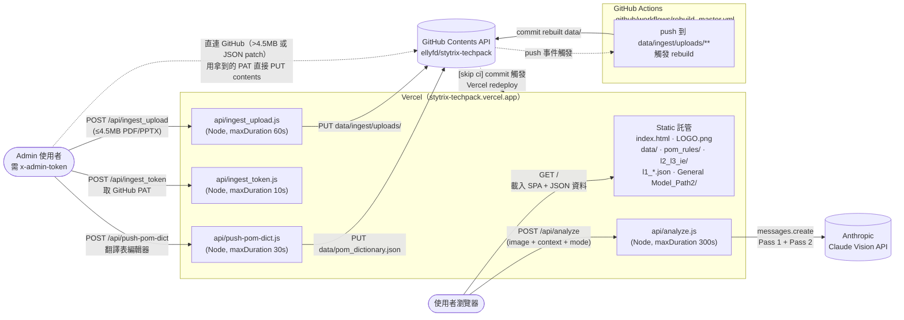
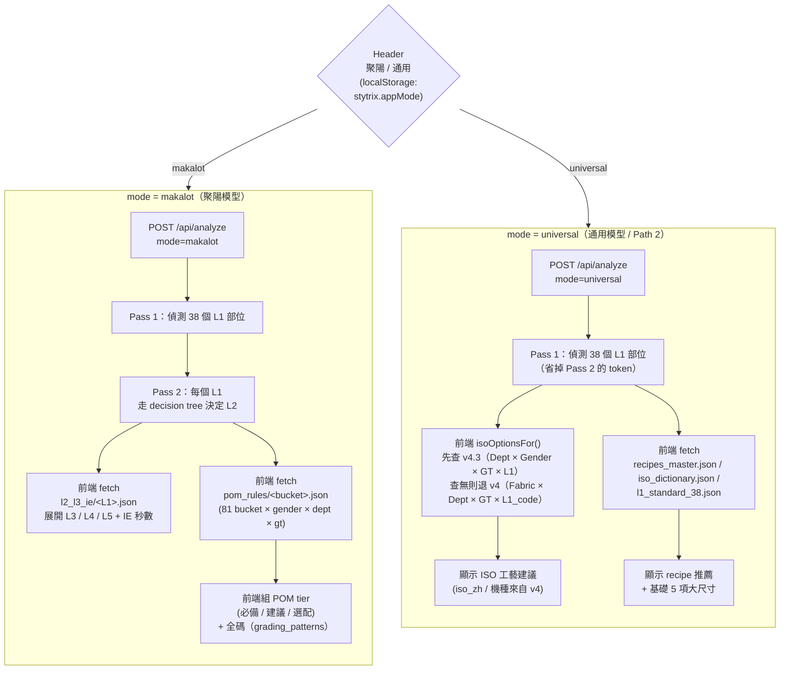
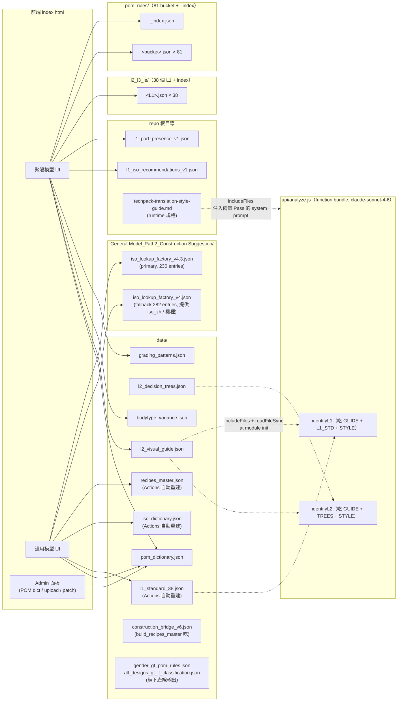
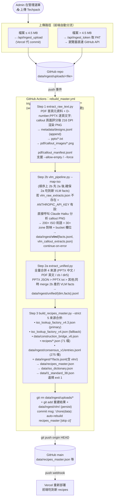

# StyTrix Techpack 網站架構圖

範圍：線上網站（前端 + Vercel Functions + GitHub Actions pipeline + 外部服務 + 資料相依）的全貌。
只畫「跑在線上或會被線上 trigger 到」的東西；純線下一次性的 `scripts/` 規則產線不在本圖內（細節見 `pom_rules_pipeline_guide_v2.md`）。

---

## 1. 高階流程（Browser → Vercel → 外部 API / Actions）

**關鍵設計**：
- 純靜態 SPA（無 bundler、無 `package.json`），React 走 CDN，整個 app 在 `index.html` 內聯。
- 所有 functions 都是 Vercel **Node.js runtime**，不是 Edge runtime。Anthropic 模型為 `claude-sonnet-4-6`。
- `api/analyze.js` 在 module init 階段 `fs.readFileSync` 讀四份：`data/l2_visual_guide.json`、`data/l2_decision_trees.json`、`data/l1_standard_38.json`、`techpack-translation-style-guide.md`。靠 `vercel.json` 的 `includeFiles: "{data/**,techpack-translation-style-guide.md}"` 把檔打包進 function bundle（先前改成 fetch 會 hang 到 timeout）。
- `api/ingest_token` 的作用只有一個：把 `GITHUB_PAT` 給已驗證的 admin，讓瀏覽器**直連** GitHub API，繞過 Vercel 4.5MB body 上限（PPTX 常超過）。較小檔或伺服端控制的情境才走 `api/ingest_upload`。
- **JSON patch 流程**（PatchUploadModal）**永遠**走直連，不經 Vercel endpoint；recipes_master 大檔（>1MB）改用 Blob API。
- 資料重建**不經過 Vercel function**——是 GitHub Actions workflow 在 GitHub 端跑的。

---

## 2. 前端模式分流（Header 切換的兩條 pipeline）

`localStorage.stytrix.appMode` 控制整個 UI 與後端走哪條路。

---

## 3. 資料檔依賴圖（誰吃誰）

實線 = 線上 runtime 直接讀；虛線 = 靠 `vercel.json includeFiles` 編進 function bundle。

> 位置債：`l1_part_presence_v1.json` 與 `l1_iso_recommendations_v1.json` 還在 repo
> 根目錄，不在 `data/`。移動會動到 `index.html` 兩處 fetch path，還沒重構。

---

## 4. Ingest Pipeline（PATH2 Phase 2：PDF/PPTX → 自動重建 recipes_master）

使用者丟一份新 Techpack 進 UI，到 `data/recipes_master.json` 更新、Vercel 重新部署，**完全不需要本機環境**。

**細節**：
- workflow 只在 `data/ingest/uploads/**` 有變動時觸發；手動 `workflow_dispatch` 可帶 `force=true` 忽略已處理設計全部重跑。
- Step 1 PDF 掃首頁抓季節 / 品牌 / 設計類型、用正規式抽 D-number；callout 頁面評分系統（ISO +3、標題 +3、縫線 +2），硬排除等級評估 / 靈感 / 狀態表格。
- **Step 2b 排在 Step 2a 之前**（2026-04-23 P1 修正，commit `32dc78c`），讓 Step 2a 的 unified 合併能吃到本次 run 剛產出的 VLM facts，而不是上一輪的舊資料。
- **Step 2b 現在自動呼 Claude**：若沒有預填的 `vlm_raw_extracts.json` 但 `ANTHROPIC_API_KEY` 有設，會對 Step 1 產出的每張 callout PNG 呼叫 Claude Haiku（`anthropic>=0.25.0`），輸出到 facts.jsonl（含 `bucket` 欄位，Step 3 才能用）。之前是 no-op——PNG 從沒真的送去分析過。`continue-on-error: true` 維持不變。
- Step 2a **全量重建**（吃所有歷史 facts + 新增的），不是增量 append，輸出 deterministically 一致。
- Step 3 aggregation 優先級：`same_sub (recipe) > same_bucket (consensus + facts) > same_gt (v4.3) > general (v4) > cross_design (bridge)`。
- Step 4 commit 會 `git add data/ingest/vlm/`，讓 VLM 分析結果持久化到 repo（之前沒存）。
- workflow commit 帶 `[skip ci]` 避免重建結果觸發自己；Vercel 偵測 push → 自動重新部署。
- **前端 CI 追蹤**：`UploadModal` 拿 sha 後 poll `GET /repos/.../actions/runs?head_sha=<sha>`，依 workflow 實際步驟順序顯示：`1｜拆解文字 & callout 圖片` → `2b｜VLM 分析 callout (PDF)` → `2a｜統一萃取 (PPTX)` → `3｜重建 recipes_master` → `提交資料`。  
  Actions API 回 403/404（私人 repo / token 缺 `actions:read` scope）時 **graceful fallback**：先試不帶 token 重試，仍失敗就直接顯示 GitHub Actions 連結不再 poll（前端不會卡死）。

---

## 5. Admin 通道總表

| 入口（管理選單） | 做什麼 | 走哪條路 | 驗證 | Body 大小 |
|---|---|---|---|---|
| 📝 **POM 翻譯表編輯**（AdminModal） | 編 `data/pom_dictionary.json`，自動 diff + 產 commit message | `POST /api/push-pom-dict`（Vercel endpoint 代 commit） | `x-admin-token` | 小 |
| 📤 **上傳 Techpack**（UploadModal） | 丟 PDF/PPTX 進 `data/ingest/uploads/`，觸發 Actions 重建 | ≤ 4.5 MB：`POST /api/ingest_upload`（Vercel） &gt; 4.5 MB：`POST /api/ingest_token` → 瀏覽器直連 GitHub `PUT contents` | `x-admin-token` → 後續直連用 PAT | 無實質上限 |
| 🩹 **上傳 Patch (JSON)**（PatchUploadModal） | 本地跑完 pipeline 後，把 `recipes_master.json` 合併推送；靠 6-field key(`aggregation_level｜gender｜dept｜gt｜it｜l1`)upsert | **全程瀏覽器直連 GitHub**（非 endpoint）；大檔（>1MB）改用 Blob API | 瀏覽器帶 `Authorization: token <PAT>` | 無實質上限 |
| 📚 **權威手冊登記表**（ManualsModal） | 純 read-only 檢索，顯示 7 份權威手冊角色 / 引用鏈 | 無後端呼叫 | — | — |

所有「瀏覽器直連 GitHub」都共用 `/api/ingest_token` 發的 `GITHUB_PAT`（需 `contents: write`），PAT 只在 admin 的瀏覽器 session 內活著，不落地。

**環境變數**（Vercel Project Settings）：
- `ANTHROPIC_API_KEY` — `api/analyze.js` 呼叫 Claude Vision
- `ADMIN_TOKEN` — 所有 admin 端點的共享 token
- `GITHUB_PAT` — 寫回 GitHub 用的 PAT（contents: write）

GitHub Actions secrets（repo settings）：
- `ANTHROPIC_API_KEY` — Step 2b VLM pipeline 用
- `GITHUB_TOKEN`（自動注入）— Step 4 push 用

---

## 6. 資料夾分工（對齊 CLAUDE.md）

| 資料夾 | 線上角色 | 進來方式 |
|---|---|---|
| `index.html` | SPA 入口（React via CDN，內聯 JS/CSS） | 手寫 |
| `api/analyze.js` | Vision Pass 1 / Pass 2，外呼 Claude | 手寫 |
| `api/push-pom-dict.js` | Admin 寫回 POM 翻譯表 | 手寫 |
| `api/ingest_token.js` | 發 PAT 讓瀏覽器直連 GitHub | 手寫 |
| `api/ingest_upload.js` | Vercel 代 commit 小檔 PDF/PPTX | 手寫 |
| `data/*.json`（recipes_master、iso_dictionary、l1_standard_38） | 線上 runtime 讀 | **GitHub Actions 自動重建** |
| `data/construction_bridge_v6.json` | 跨設計 GT×zone 施工統計 | `build_recipes_master.py` 吃 |
| `data/gender_gt_pom_rules.json` / `all_designs_gt_it_classification.json` | 規則產線輸出，前端 / 後端視需要讀 | 線下產出 |
| `data/*.json`（其餘：l2_visual_guide、l2_decision_trees、grading_patterns 等） | 線上 runtime 讀 | 由 `scripts/` 產出，手動 push |
| `data/ingest/` | Ingest pipeline 暫存 / 中繼資料 | uploads 由使用者上傳；其他由 Actions 寫入 |
| `pom_rules/*.json` | 聚陽模型 81 bucket 規則庫（+ `_index.json` = 82 檔） | 由 `scripts/reclassify_and_rebuild.py` 產出（線下） |
| `l2_l3_ie/*.json` | 聚陽模型 38 部位 L2-L3-IE 規則（+ index = 39 檔） | 線下產出 |
| `General Model_Path2_Construction Suggestion/` | 通用模型 ISO 雙表 + 說明 MD | 手維護 |
| 根目錄 `l1_*.json` | 聚陽模型部位出現率 / ISO 建議 | 線下產出（位置歷史遺留） |
| 根目錄 `techpack-translation-style-guide.md` | **Runtime 規格**：做工 ISO 統一術語 + POM 翻譯 | `analyze.js` / `extract_unified.py` / `vlm_pipeline.py` 同時吃 |
| `scripts/`（10 個腳本） | **規則產線** — 跑在內部路徑 `/sessions/.../mnt/ONY`，重建 `pom_rules/` 等 | 手動執行 |
| `star_schema/scripts/`（4 個腳本） | **Ingest pipeline** — Actions workflow 呼叫 | Actions 執行 |
| 根目錄 `.md` | 跨模組規格文件（含本檔） | 手寫 |

---

## 7. 已知架構債

- `recipes/`（根目錄 71 檔，`build_recipes_master.py` 實際會吃）跟 PATH2 規劃用的 `construction_recipes/` 同指向不同名，命名混亂。
- `l1_part_presence_v1.json` / `l1_iso_recommendations_v1.json` 還在 repo 根，不在 `data/`。移動會動到 `index.html` 裡兩處 fetch path。
- `iso_lookup_factory_v4.json` 已經是 fallback，但仍被前端引用（提供 iso_zh / 機種），不能刪。
- `api/analyze.js` 的 `GUIDE` / `TREES` / `L1_STD` / `STYLE` 都是 function init 載入；改 `data/l2_*.json`、`data/l1_standard_38.json`、`techpack-translation-style-guide.md` 後，需要 Vercel redeploy 才會生效（不是熱更新）。
- Ingest workflow 的 Step 2b (`vlm_pipeline.py`) 是 `continue-on-error`——失敗時會安靜跳過，不會在 PR / commit 訊息裡浮現，需要直接翻 Actions log 才看得到。
- Step 2b 依賴 `vlm_raw_extracts.json`（手填或 API 預填），CI 無法自動生成；目前靠人工匯入或外部 API。
- `scripts/`（線下規則產線 10 檔）與 `star_schema/scripts/`（線上 ingest pipeline 4 檔）是**兩組獨立**的 pipeline，彼此不共用程式碼，也沒有統一入口；動其中一邊不會自動影響另一邊。
- CI polling 的 graceful fallback 設計良好，但當 Actions API 完全無法存取時，使用者只會看到「點連結去 GitHub」提示，無法在 app 內看到實際失敗原因。

---

## 8. 權威靜態手冊登記表

> 凡有 2 個以上檔案引用、且對線上資料或規則產線有決定性影響的手冊，列此備查。
> 改動任一手冊前，請先確認「被誰消費」一欄列的下游是否需要同步重建。

### A 級 — 腳本直接消費，輸出線上 runtime 資料

| 手冊 | 位置 | 被誰消費 | 輸出（線上） | 引用檔案 |
|------|------|---------|------------|---------|
| `L2_VLM_Decision_Tree_Prompts_v2.md` | repo 根目錄 | `scripts/build_l2_decision_trees.py` | `data/l2_decision_trees.json`（AI Pass 2） | `CLAUDE.md`；49 hard-negative pairs 已於 2026-04-23 合併入末尾 § 混淆對照表 |
| `L2_Visual_Differentiation_FullAnalysis_修正版.md` | repo 根目錄 | `scripts/build_l2_visual_guide.py` | `data/l2_visual_guide.json`（AI Pass 1/2） | `L2_VLM_Decision_Tree_Prompts_v2.md`、`scripts/build_l2_visual_guide.py` |
| `L1_部位定義_Sketch視覺指引.md` | repo 根目錄（另有一份在 `General Model_Path2_Construction Suggestion/`，MD5 相同） | `api/analyze.js` Pass 1 system prompt 來源、`star_schema/scripts/vlm_pipeline.py` | VLM Pass 1 辨識能力 | `PATH2_通用模型_做工推薦Pipeline.md`、`README.md`（×2）、`L2_VLM_Decision_Tree_Prompts_v2.md` |

> ⚠ A 級手冊改動後，必須重跑對應 `scripts/build_l2_*.py` 並 push 新的 `data/*.json`；
> Vercel function bundle 需要重新部署才能讀到新版本（非熱更新）。

### B 級 — 跨模組規格文件，制定規則與術語

| 手冊 | 位置 | 作用 | 引用檔案 | 備注 |
|------|------|------|---------|------|
| `pom_rules_v55_classification_logic.md` | repo 根目錄 | v5.5.1 分類邏輯完整說明（Gender / Dept / GT / Fabric 四維度） | `README.md`、`pom_rules_pipeline_guide_v2.md`、`scripts/reclassify_and_rebuild.py` header | 改分類邏輯必讀 |
| `pom_rules_pipeline_guide_v2.md` | repo 根目錄 | 線下規則產線五階段操作手冊（extract → rebuild → enforce → fix → push） | `CLAUDE.md`、`README.md`、`scripts/reclassify_and_rebuild.py`、`scripts/enforce_tier1.py` | 2026-04-23 升為 primary（v1 已刪） |
| `techpack-translation-style-guide.md` | repo 根目錄 | 做工 ISO 統一術語 + 四客戶 10,035 筆 POM 翻譯裁決（袖襱 / 門襟 / 克夫 / …），2026-04-23 起升為 **runtime 規格** | `api/analyze.js`（module init 讀）、`star_schema/scripts/{extract_unified,vlm_pipeline,build_recipes_master}.py`、`vercel.json` includeFiles、`README.md` | 改這份直接影響 AI 回覆用字 + 線上 ingest pipeline 的中文對映 |
| `五階層展開項目_20260402.xlsx` | repo 根目錄 | L2–L5 層展開的原始規格底稿（9.5 MB） | `pom_rules_pipeline_guide_v2.md`（×2）、`CLAUDE.md` | 無腳本直接讀；屬人工參考底稿 |

### 說明

- **A 級**：手冊 → 腳本消費 → JSON → 線上 AI 能力。任何修改都需要重建下游 JSON 並重新部署。
- **B 級**：手冊 → 人工流程 / 規則產線參考。不直接影響線上，但決定產出 `pom_rules/` 的邏輯正確性與翻譯一致性。
- 本表由人工維護。新增手冊引用超過 2 個檔案時，請同步更新本節。
