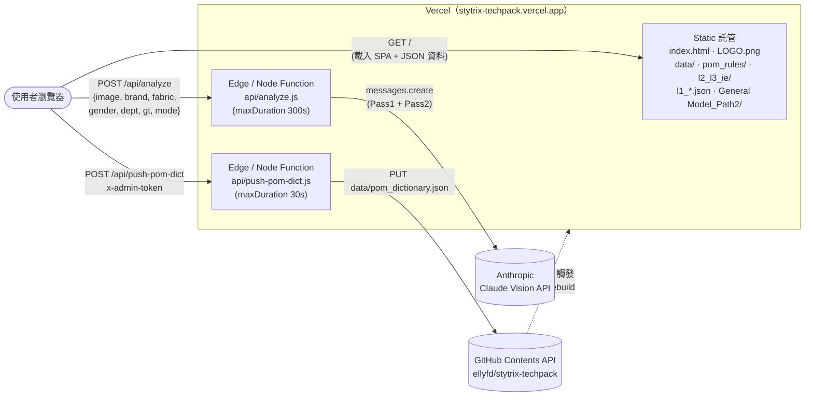
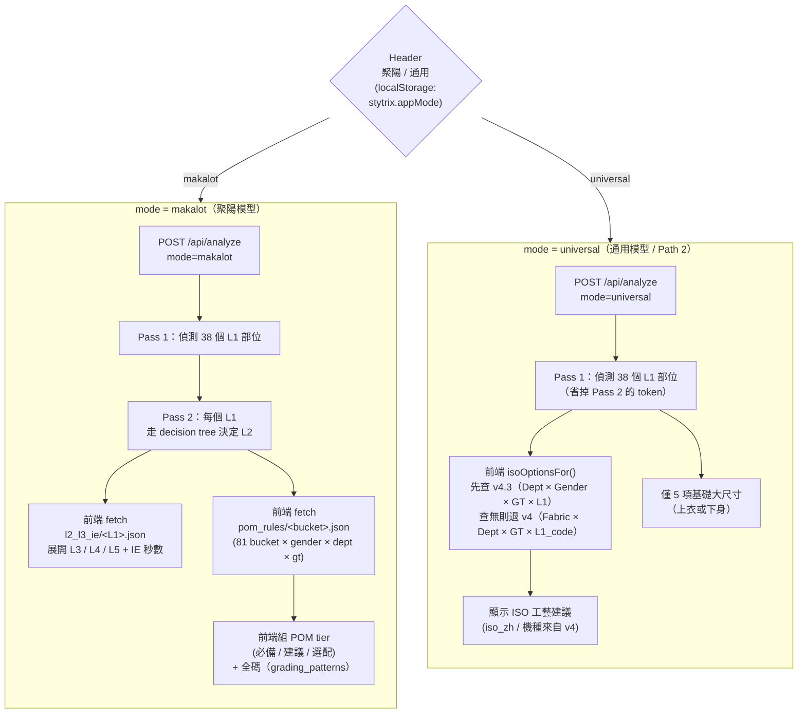
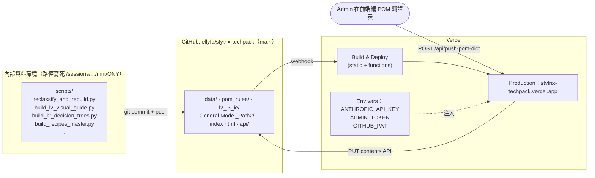

# StyTrix Techpack 網站架構圖

範圍：線上網站（前端 + Vercel Functions + 外部服務 + 資料相依）的全貌。
資料管線（`scripts/`）只在內部環境跑，不屬於線上 runtime，這裡只標出
「產出 → 線上吃哪份檔」的銜接，不展開。

---

## 1. 高階流程（Browser → Vercel → 外部 API）



關鍵點：
- 純靜態 SPA（無 bundler、無 `package.json`），React 走 CDN，整個 app 在 `index.html` 內聯。
- 兩支 function 都是 Vercel Node.js runtime（不是 Edge runtime；`api/analyze.js` 第 1 行寫死 `runtime: "nodejs"`）。
- `api/analyze.js` 在 module init 階段用 `fs.readFileSync` 讀 `data/l2_visual_guide.json` 與 `data/l2_decision_trees.json`；`vercel.json` 的 `includeFiles: "data/**"` 把這兩支檔打包進 function bundle，**不是** runtime fetch（先前用 fetch 會 hang 到 timeout，已改）。
- `api/push-pom-dict.js` 是 admin 通道，會把前端編輯後的 POM 翻譯表 commit 回 main 分支，再由 Vercel 自動重建。

---

## 2. 前端模式分流（Header 切換的兩條 pipeline）

`localStorage.stytrix.appMode` 控制整個 UI 與後端走哪條路。



---

## 3. 資料檔依賴圖（誰吃誰）

虛線 = 線下產出 / 來源，實線 = 線上 runtime 直接讀。

```mermaid
flowchart LR
  subgraph Front["前端 index.html"]
    FE_make["聚陽模型 UI"]
    FE_uni["通用模型 UI"]
    FE_admin["POM dict 編輯器"]
  end

  subgraph Fn["api/analyze.js（function bundle）"]
    FN_pass1["identifyL1<br/>（吃 GUIDE）"]
    FN_pass2["identifyL2<br/>（吃 GUIDE + TREES）"]
  end

  subgraph DataDir["data/"]
    D_guide["l2_visual_guide.json"]
    D_trees["l2_decision_trees.json"]
    D_grading["grading_patterns.json"]
    D_bodyvar["bodytype_variance.json"]
    D_pomdict["pom_dictionary.json"]
    D_recipes["recipes_master.json"]
    D_isodict["iso_dictionary.json"]
    D_l1std["l1_standard_38.json"]
  end

  subgraph PomRules["pom_rules/（81 bucket）"]
    P_index["_index.json"]
    P_files["&lt;bucket&gt;.json × 81"]
  end

  subgraph IE["l2_l3_ie/（38 個 L1）"]
    IE_files["&lt;L1&gt;.json × 38"]
  end

  subgraph Path2["General Model_Path2_Construction Suggestion/"]
    G_v43["iso_lookup_factory_v4.3.json<br/>(primary)"]
    G_v4["iso_lookup_factory_v4.json<br/>(fallback, 提供 iso_zh / 機種)"]
  end

  subgraph Root["repo 根目錄"]
    R_pres["l1_part_presence_v1.json"]
    R_iso["l1_iso_recommendations_v1.json"]
  end

  %% function bundle (compile-time include)
  D_guide -. "vercel.json includeFiles<br/>readFileSync at init" .-> FN_pass1
  D_guide -. "" .-> FN_pass2
  D_trees -. "" .-> FN_pass2

  %% 聚陽模型 runtime fetch
  FE_make --> P_index
  FE_make --> P_files
  FE_make --> IE_files
  FE_make --> R_pres
  FE_make --> R_iso
  FE_make --> D_grading
  FE_make --> D_bodyvar
  FE_make --> D_guide

  %% 通用模型 runtime fetch
  FE_uni --> G_v43
  FE_uni --> G_v4
  FE_uni --> D_recipes
  FE_uni --> D_isodict
  FE_uni --> D_l1std

  %% 共用
  FE_make --> D_pomdict
  FE_uni --> D_pomdict

  %% admin
  FE_admin --> D_pomdict
```

> 註：`l1_part_presence_v1.json` 與 `l1_iso_recommendations_v1.json` 還在 repo
> 根目錄、不在 `data/`，是歷史擺位；遷移要動到前端 fetch path，這次不處理。

---

## 4. 部署與資料更新流



---

## 5. 對齊 CLAUDE.md 的資料夾分工

| 資料夾 | 線上角色 | 進來方式 |
|---|---|---|
| `index.html` | SPA 入口（React via CDN，內聯 JS/CSS） | 手寫 |
| `api/analyze.js` | Vision Pass 1 / Pass 2，外呼 Claude | 手寫 |
| `api/push-pom-dict.js` | Admin 寫回 GitHub 的後門 | 手寫 |
| `data/*.json` | 線上 runtime 直接讀（前端 fetch + function init） | 大多由 `scripts/` 產出，少數手維護 |
| `pom_rules/*.json` | 聚陽模型的 81 bucket 規則庫 | 由 `reclassify_and_rebuild.py` 自動寫入 |
| `l2_l3_ie/*.json` | 聚陽模型的 38 部位 L2-L3-IE 規則 | 自動產出 |
| `General Model_Path2_Construction Suggestion/` | 通用模型 ISO 雙表查詢 | 手維護 + script 增補 |
| 根目錄 `l1_*.json` | 聚陽模型部位出現率 / ISO 建議 | 自動產出（位置歷史遺留） |
| 根目錄 `.md` | 跨模組規格文件（含本檔） | 手寫 |

---

## 6. 已知架構債（給下個維護者）

- `recipes/`（72 檔）目前無人引用；PATH2 規劃用的是 `construction_recipes/`（不同名）。下輪清理候選，須先跑 CLAUDE.md Part B 的 grep gate。
- `l1_part_presence_v1.json` / `l1_iso_recommendations_v1.json` 還在 repo 根，不在 `data/`；移動會動到 `index.html` 裡兩處 fetch path。
- `iso_lookup_factory_v4.json` 已經是 fallback，但仍被前端引用（提供 iso_zh / 機種），不能刪。
- `api/analyze.js` 的 GUIDE / TREES 是 function init 載入；改 `data/l2_visual_guide.json` 或 `l2_decision_trees.json` 後，需要 Vercel redeploy 才會生效（不是熱更新）。
